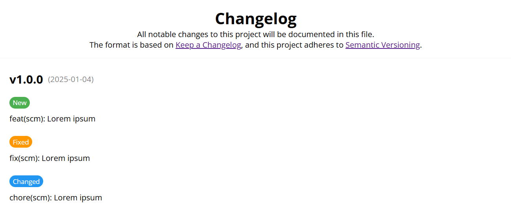
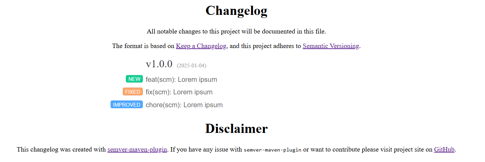
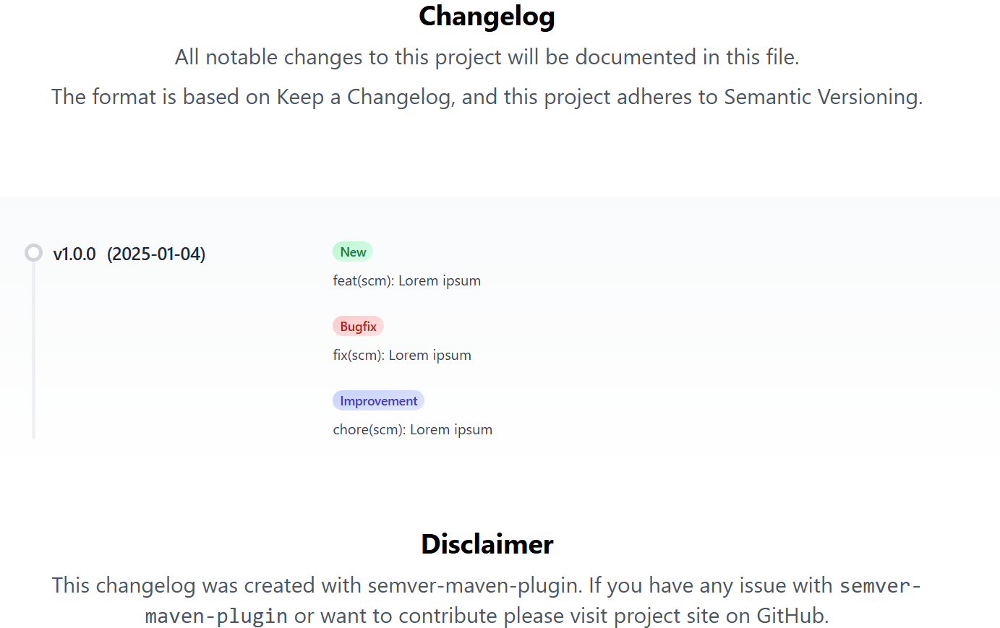

# Html-Changelog-Renderer

## Templates

### Default

The _Default_ template is based on [aolko's](https://codepen.io/aolko) changelog [template](https://codepen.io/aolko/pen/ROPpvv)
published on [Codepen.io](https://codepen.io/) under MIT
[license](https://blog.codepen.io/documentation/licensing/).



### Missive

The _Missive_ template is based on [Missive's](https://missiveapp.com/) free to use changelog
[template](https://missiveapp.com/goodies/changelog.html.zip).

> Note: Since this template was originally intended for usage in email newsletters it
> uses HTML tables for internal format instead CSS.



### Spinal

The _Spinal_ template is based on [Spinal's](https://spinalcms.com/) changelog [template](https://github.com/SpinalCMS/saas-changelog-template)
published on [GitHub](https://github.com/SpinalCMS/saas-changelog-template) under MIT
[license](https://github.com/SpinalCMS/saas-changelog-template/blob/main/LICENSE).

> Note: This template originally used the CDN version of Tailwind CSS with \
> `<script src="https://cdn.tailwindcss.com"></script>`. \
> This is not a recommended approach for production sites.
> 
> Please check [Tailwind CSS Build section](#tailwind-css) for instructions how to generate a minified
> CSS file for production.



## Build

### Tailwind CSS
Documentation:
- https://tailwindcss.com/docs/installation
- https://tailwindcss.com/blog/standalone-cli

#### Download CLI
e.g. for Windows x64:
```bash
$ curl -sLO https://github.com/tailwindlabs/tailwindcss/releases/download/v3.4.17/tailwindcss-windows-x64.exe
$ mv tailwindcss-windows-x64.exe tailwind/tailwindcss.exe
```

#### Create config
Initialize `tailwind.config.js`:
```bash
$ ./tailwind/tailwindcss.exe init
```

#### Start watcher
```bash
$ ./tailwind/tailwindcss.exe \
    -c tailwind/tailwind.config.js \
    -i tailwind/base.css \
    -o src/main/resources/templates/spinal/spinal.css \
    --watch
```

#### Compile and minify
```bash
$ ./tailwind/tailwindcss.exe \
    -c tailwind/tailwind.config.js \
    -i tailwind/base.css \
    -o src/main/resources/templates/spinal/spinal.css \
    --minify
```