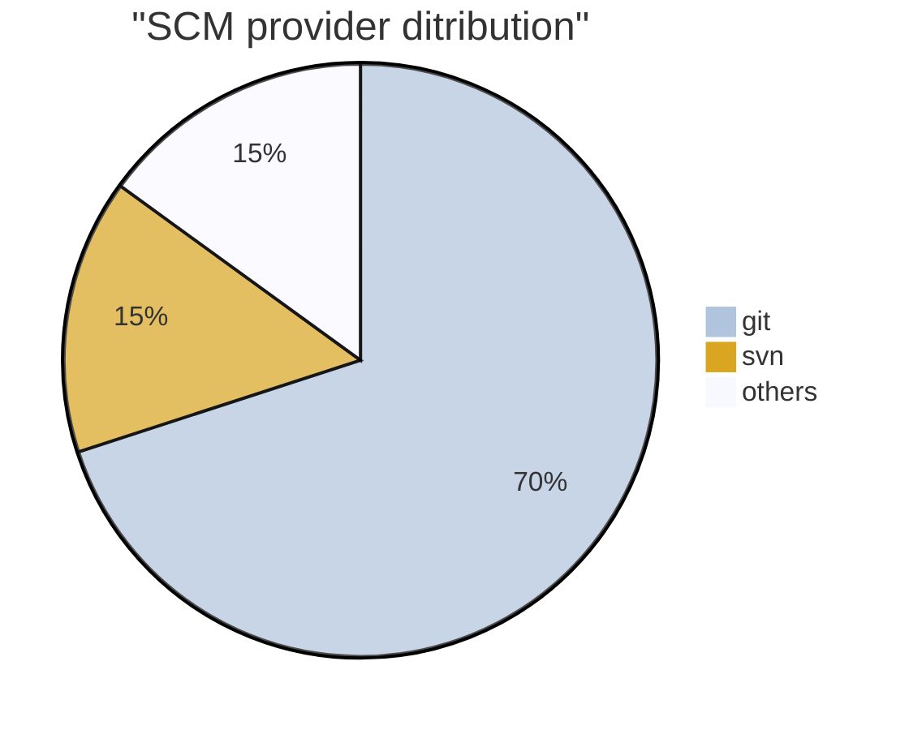

# SCM provider distribution

```mermaid
%%{init: {'theme': 'base', 'themeVariables': {'pie1': 'lightsteelblue', 'pie2': 'goldenrod', 'pie3': 'ghostwhite'}}}%%
pie title "SCM provider ditribution"
  "git": 70
  "svn": 15
  "others": 15
```

source: [worldmetrics.org](https://worldmetrics.org/version-control-systems-industry-statistics/)